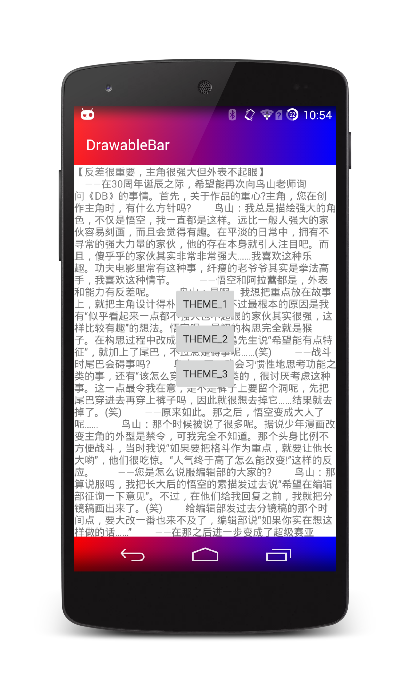
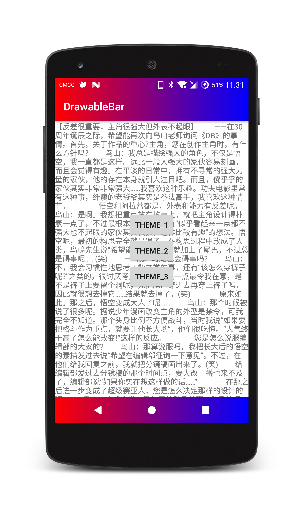
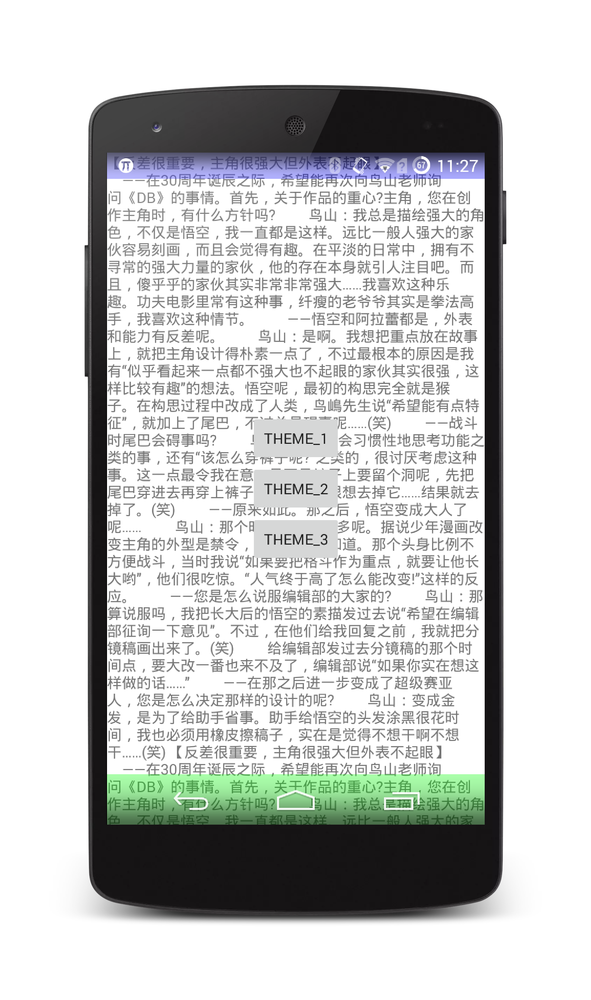
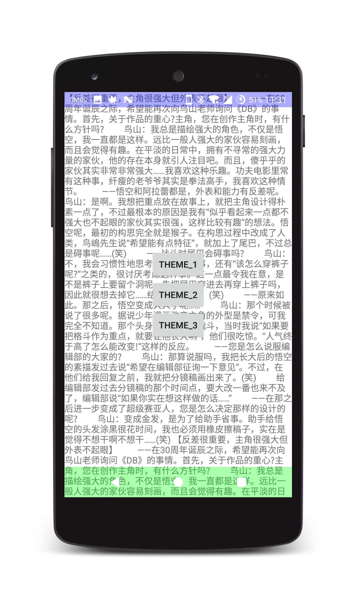
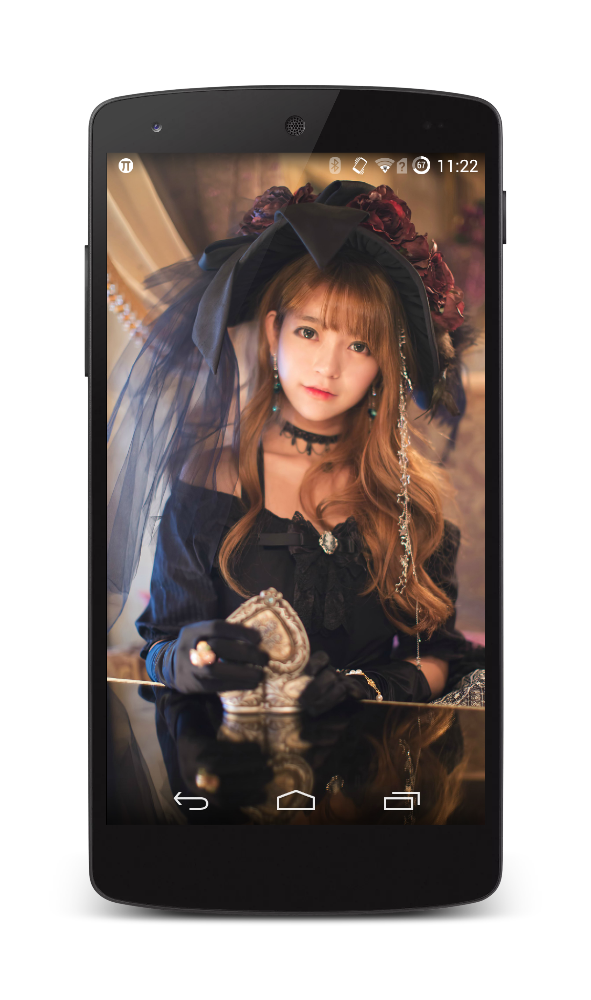
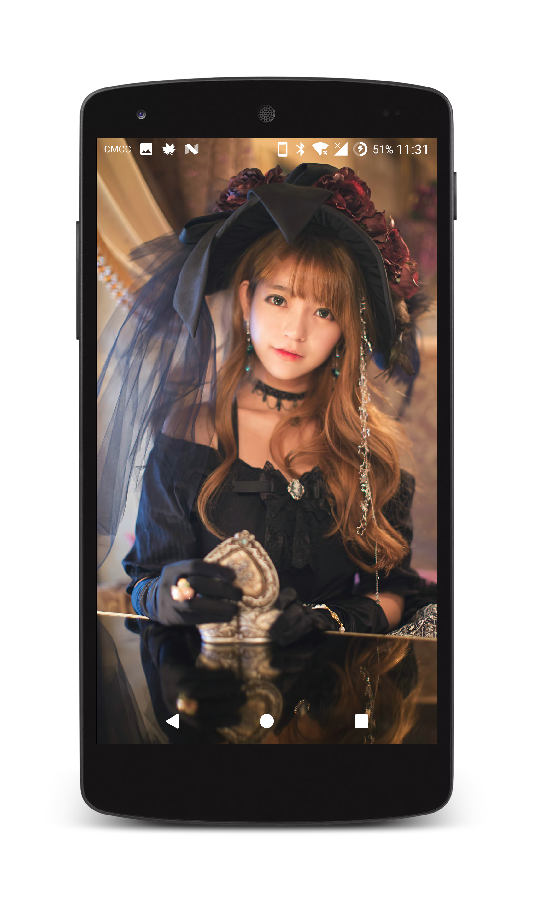
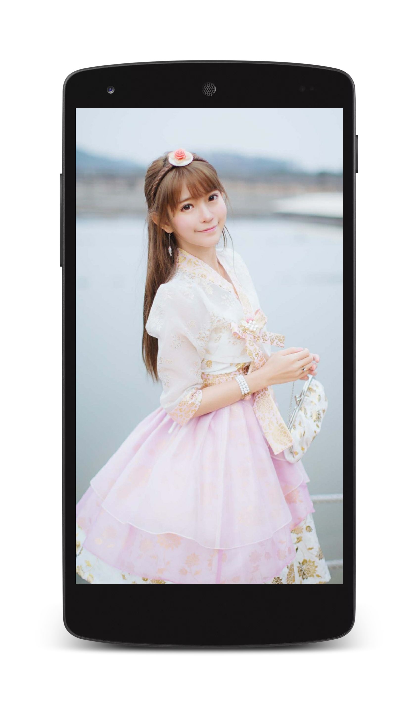
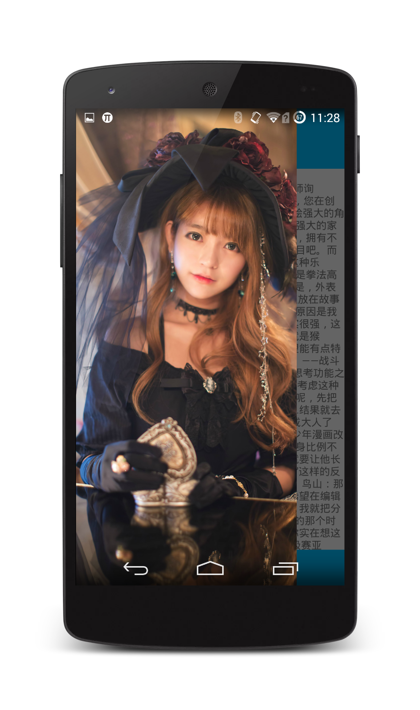
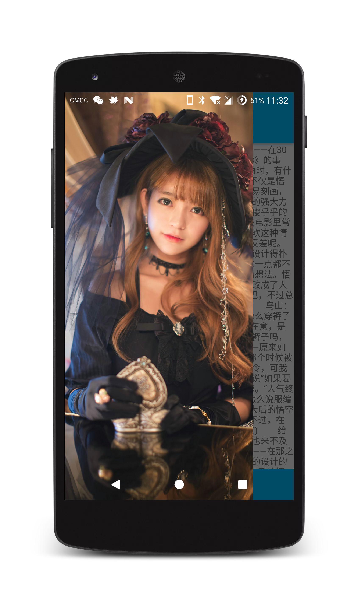
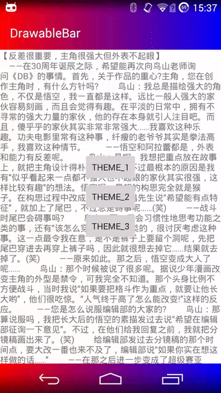

# UltimateBar
透明状态栏导航栏、沉浸式状态栏导航栏的终极解决方案


## 特点：

1.四种效果，自定义状态栏和导航栏的 drawable，状态栏和导航栏半透明，沉浸式状态栏和导航栏，隐藏状态栏和导航栏；<br/>
2.可以自定义状态栏和导航栏的 drawable；<br/>
3.状态栏和导航栏可以分开设置，分别设置不同的 drawable；<br/>
4.可以只设置状态栏或者状态栏和导航栏同时设置；<br/>
5.针对 DrawerLayout 做了专门的适配；<br/>
6.KITKAT(Android 4.4) 和 LOLLIPOP(Android 5.0) 上显示效果高度统一；<br/>
7.状态栏和导航栏可以设置灰色模式;<br/>
8.同一种效果可以多次设置，<br/>
9.设置灰色模式时可以在低版本上重设置状态栏和导航栏颜色。<br/>

## 使用方法：

gradle：

```groovy
implementation 'com.github.zackratos.ultimatebar:ultimatebar3:3.1.1'
```

### 1. 自定义状态栏和导航栏的 drawable

在 onCreate() 方法中：

```java
UltimateBar.Companion.with(this)
        .statusDark(false)                  // 状态栏灰色模式(Android 6.0+)，默认 flase
        .statusDrawable(drawable)           // 状态栏背景，默认 null
        .statusDrawable2(drawable2)         // Android 6.0 以下状态栏灰色模式时状态栏颜色
        .applyNavigation(true)              // 应用到导航栏，默认 flase
        .navigationDark(false)              // 导航栏灰色模式(Android 8.0+)，默认 false
        .navigationDrawable(drawable)       // 导航栏背景，默认 null
        .navigationDrawable2(drawable2)     // Android 8.0 以下导航栏灰色模式时导航栏颜色
        .create()
        .drawableBar();
```


<br/><br/>




<br/><br/><br/>


### 2. 半透明状态栏和导航栏

在 onCreate() 方法中：

```java
UltimateBar.Companion.with(this)
        .statusDark(false)                  // 状态栏灰色模式(Android 6.0+)，默认 flase
        .statusDrawable(drawable)           // 状态栏背景，默认 null
        .statusDrawable2(drawable2)         // Android 6.0 以下状态栏灰色模式时状态栏颜色
        .applyNavigation(true)              // 应用到导航栏，默认 flase
        .navigationDark(false)              // 导航栏灰色模式(Android 8.0+)，默认 false
        .navigationDrawable(drawable)       // 导航栏背景，默认 null
        .navigationDrawable2(drawable2)     // Android 8.0 以下导航栏灰色模式时导航栏颜色
        .create()
        .transparentBar();
```


<br/><br/>



<br/><br/><br/>


### 3. 沉浸式状态栏和导航栏：

在 onCreate() 方法中：<br/><br/>

```java
UltimateBar.Companion.with(this)
        .statusDark(false)                  // 状态栏灰色模式(Android 6.0+)，默认 flase
        .statusDrawable2(drawable2)         // Android 6.0 以下状态栏灰色模式时状态栏颜色
        .applyNavigation(true)              // 应用到导航栏，默认 flase
        .navigationDark(false)              // 导航栏灰色模式(Android 8.0+)，默认 false
        .navigationDrawable2(drawable2)     // Android 8.0 以下导航栏灰色模式时导航栏颜色
        .create()
        .immersionBar();
```


<br/><br/>




<br/><br/><br/>


### 4. 隐藏状态栏和导航栏：

在 onWindowFocusChanged() 方法中：

```java
@Override
public void onWindowFocusChanged(boolean hasFocus) {
    super.onWindowFocusChanged(hasFocus);
    if (hasFocus) {
        UltimateBar.Companion.with(this)
                .applyNavigation(true)      // 是否应用到导航栏
                .create()
                .hideBar();
    }
}
```


<br/><br/>

<br/><br/><br/>


### 5. 在 DrawerLayout 中设置自定义 drawable 的状态栏和导航栏：

在 onCreate() 方法中：

```java
UltimateBar.Companion.with(this)
        .statusDark(false)                  // 状态栏灰色模式(Android 6.0+)，默认 flase
        .statusDrawable(drawable)           // 状态栏背景，默认 null
        .statusDrawable2(drawable2)         // Android 6.0 以下状态栏灰色模式时状态栏颜色
        .applyNavigation(true)              // 应用到导航栏，默认 flase
        .navigationDark(false)              // 导航栏灰色模式(Android 8.0+)，默认 false
        .navigationDrawable(drawable)       // 导航栏背景，默认 null
        .navigationDrawable2(drawable2)      // Android 8.0 以下导航栏灰色模式时导航栏颜色
        .create()
        .drawableBarDrawer(drawerLayout,    // DrawerLayout
                content,                    // DrawerLayout 的主布局 View
                drawer);                    // DrawerLayout 的抽屉布局 View
```


<br/><br/>




<br/><br/><br/>

### 6. 在 Fragment 中使用
若要在 Fragment 中使用，可以先设置 Fragment 所在的 Activity 沉浸，然后再设置 Fragment,
可以参考 demo 中的写法。

<br/><br/><br/>

### 7. kotlin 中的使用
若你的 Activity 是 kotlin 语言，可以直接调用 with() 方法生成 UltimateBar 对象，然后配置参数
```kotlin
ultimateBarBuilder().statusDark(false)      // 状态栏灰色模式(Android 6.0+)，默认 flase
        .statusDrawable(drawable)           // 状态栏背景，默认 null
        .statusDrawable2(drawable2)         // Android 6.0 以下状态栏灰色模式时状态栏颜色
        .applyNavigation(true)              // 应用到导航栏，默认 flase
        .navigationDark(false)              // 导航栏灰色模式(Android 8.0+)，默认 false
        .navigationDrawable(drawable)       // 导航栏背景，默认 null
        .navigationDrawable2(drawable2)     // Android 8.0 以下导航栏灰色模式时导航栏颜色
        .create()
        .drawableBar()
```

<br/><br/><br/>
<!---->
<!---->
<!--<br/><br/><br/>-->


## 更新日志

### v3.1.1 (2018.11.19)
1.优化添加 StatusBarView 和 NavigationBarView 的流程；<br/>
2.移除无用的 @TargetApi 注解。

### v3.1.0 (2018.11.16)
1.设置灰色模式时，若 Android 版本不支持灰色模式，可以重新设置状态栏和导航栏的颜色，避免
白色状态栏或者导航栏遮挡了图标和文字的尴尬。

### v3.0.1 (2018.11.14)
1.将 kotlin 中对 Activity 扩展的方法重命名为 ultimateBarBuilder；<br/>
2.优化移除导航栏 View 的方法；<br/>
3.依赖的 v4 包版本降为 27（为了降低接入标准）。

### v3.0.0 (2018.11.07)
1.使用 kotlin 语言重构；<br/>
2.删除无用的透明度和颜色深度，直接设置 drawable；<br/>
3.增加灰色模式；<br/>
4.同一种效果可以进行多次设置。

### v2.0.0 (2017.11.27)
1.采用 Builder 模式重构代码；<br/>
2.修复 DrawerLayout 中使用自定义颜色模式时，不应用到导航栏时导航栏颜色透明的 bug。

### v1.2.0 (2017.11.27)
1.修改包名；<br/>
2.替换部分图片。

### v1.1.2 (2017.11.22)
1.重命名仅设置状态栏半透明的方法名为 setTransparentStatusBar，之前为 setTransparentBar；<br/>
2.在相应的方法中增加必要的注释；<br/>
3.当传入的颜色深度或透明度的值小于 0 时转化为 0，大于 255 时转化为 255；<br/>
4.修改 .gitignore 文件，删除不必要的 .idea 目录。


### v1.1.1 (2017.10.17)
1.取消单独设置导航栏的方法（无法实现，实际中也没有这种奇葩需求）；<br/>
2.修改每种设置方法的参数，可以在同一个方法中分别对状态栏和导航栏的属性进行设置。

### v1.1.0 (2017.10.12)
1.module 名从 ultimate 改为 ultimatebar；<br/>
2.隐藏状态栏和导航栏的方法名从 hintBar 改为 hideBar （英文不好，之前一直以为 hint 是隐藏的意思）；<br/>
3.增加单独设置状态栏和单独设置导航栏的方法。


### v1.0.3
1.在 Android 4.4 中使用自定义颜色的状态栏和导航栏的时候，如果没有导航栏，不设置导航栏。


### v1.0.2
1.增加 DrawerLayout 使用的自定义颜色的状态栏和导航栏。

### v1.0.1
1.判断当状态栏不存在时，不对状态栏进行设置；<br/>
2.自定义颜色的状态栏和导航栏中，当加深程度为 0 时，直接设置为原颜色，即不加深颜色；<br/>
3.半透明的状态栏和导航栏中，当不透明度为 0 时，直接设为完全透明，即不进行不透明度计算；<br/>
4.修改包名。


### v1.0.0
1.四种效果，自定义颜色的状态栏和导航栏，半透明状态栏和导航栏，
沉浸式状态栏和导航栏，隐藏状态栏和导航栏；<br/>
2.可以自定义状态栏和导航栏的颜色和透明度；<br/>
3.KITKAT(Android 4.4)和LOLLIPOP(Android 5.0)上显示效果高度统一。<br/>


## License

```
Copyright 2017 Zackratos

Licensed under the Apache License, Version 2.0 (the "License");
you may not use this file except in compliance with the License.
You may obtain a copy of the License at

    http://www.apache.org/licenses/LICENSE-2.0

Unless required by applicable law or agreed to in writing, software
distributed under the License is distributed on an "AS IS" BASIS,
WITHOUT WARRANTIES OR CONDITIONS OF ANY KIND, either express or implied.
See the License for the specific language governing permissions and
limitations under the License.