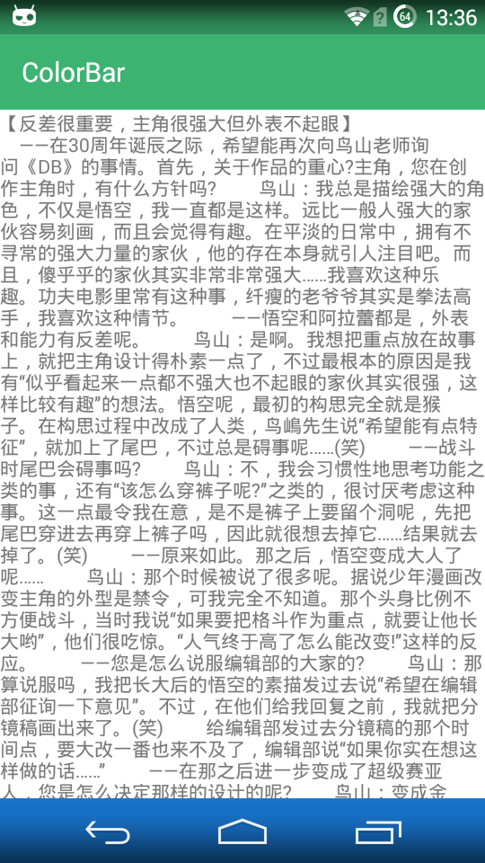
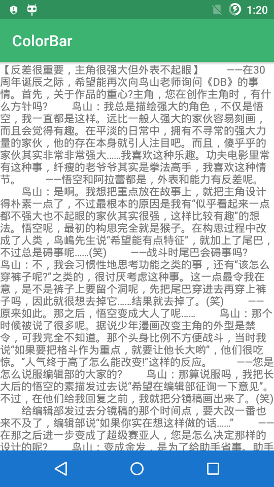
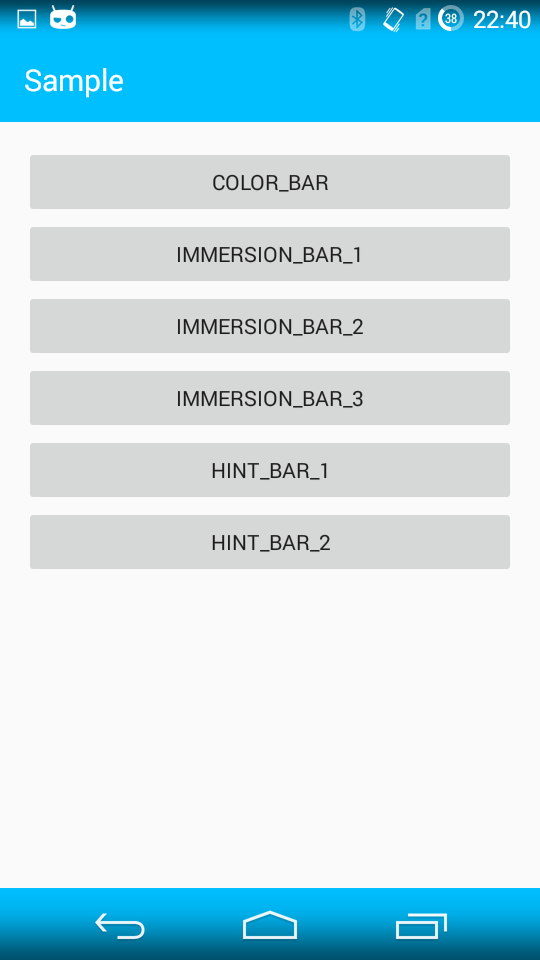
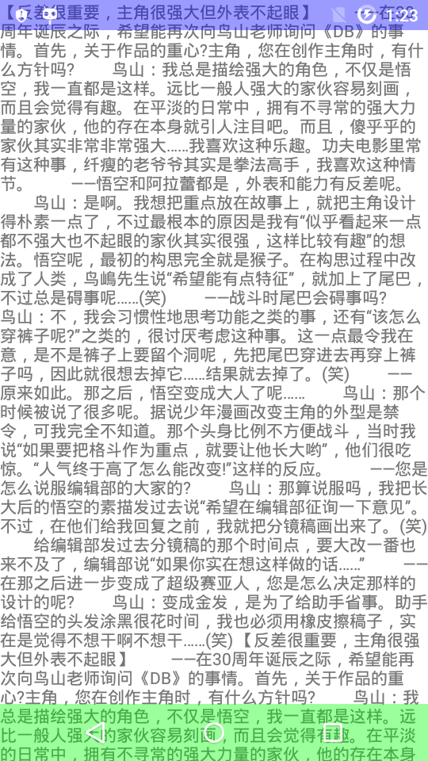
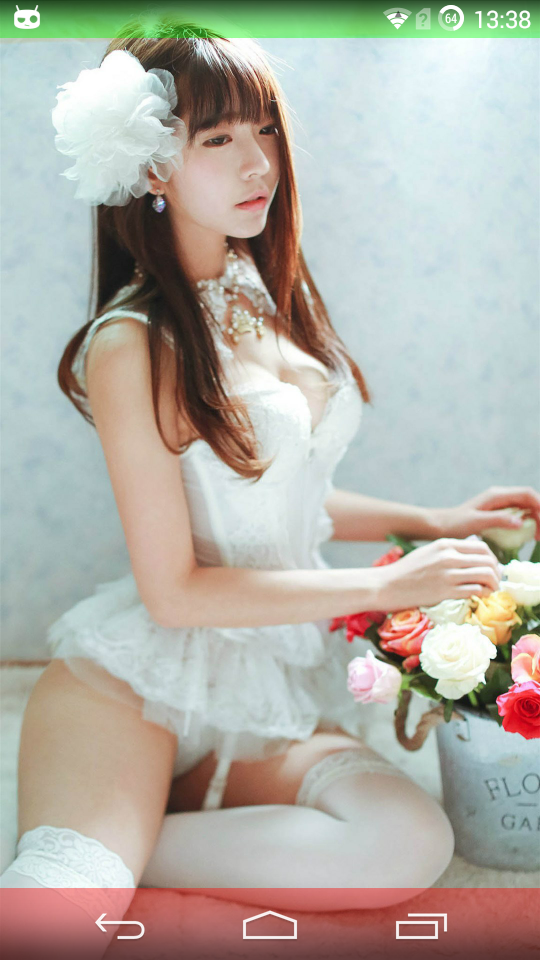
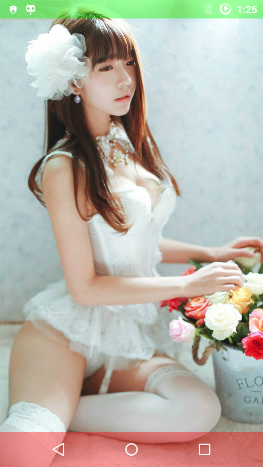
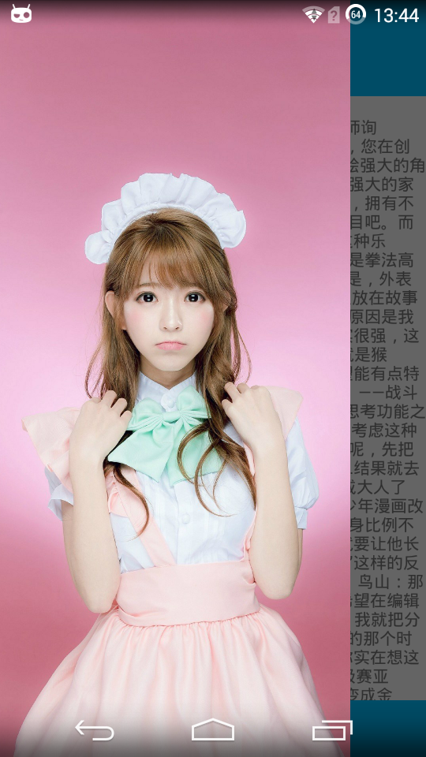
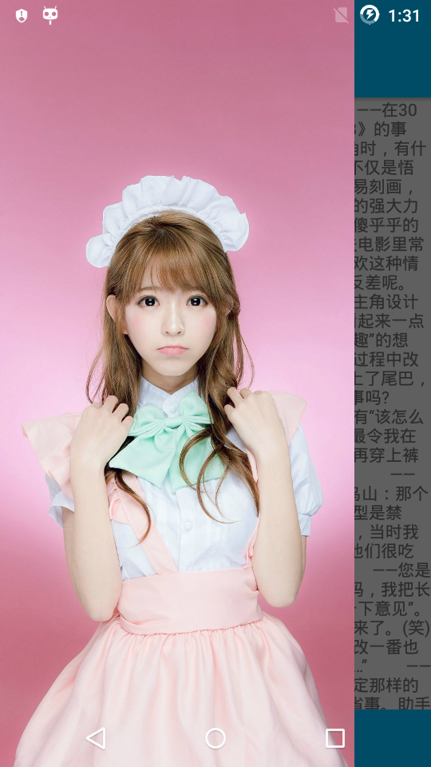

# UltimateBar
透明状态栏导航栏、沉浸式状态栏导航栏的终极解决方案


## 特点：

1.四种效果，自定义颜色的状态栏和导航栏，半透明状态栏和导航栏，沉浸式状态栏和导航栏，隐藏状态栏和导航栏；<br/>
2.可以自定义状态栏和导航栏的颜色和透明度；<br/>
3.状态栏和导航栏可以分开设置，分别设置不同的颜色和透明度；<br/>
4.可以只设置状态栏或者状态栏和导航栏同时设置；<br/>
5.针对 DrawerLayout 的自定义颜色的状态栏和导航栏做了专门的适配；<br/>
6.KITKAT(Android 4.4)和LOLLIPOP(Android 5.0)上显示效果高度统一。<br/>

## 使用方法：

gradle：

```xml
compile 'com.github.zackratos.ultimatebar:ultimatebar2:2.0.0'
```

### 1.自定义颜色的状态栏和导航栏

在 onCreate() 方法中：

```java
UltimateBar.newColorBuilder()
        .statusColor(statusColor)       // 状态栏颜色
        .statusDepth(50)                // 状态栏颜色深度
        .applyNav(true)                 // 是否应用到导航栏
        .navColor(navColor)             // 导航栏颜色
        .navDepth(50)                   // 导航栏颜色深度
        .build(this)
        .apply();
```


<br/><br/>



<br/><br/>


如果不需要设置颜色深度：

```java
UltimateBar.newColorBuilder()
        .statusColor(statusColor)   // 状态栏颜色
        .applyNav(true)             // 是否应用到导航栏
        .navColor(navColor)         // 导航栏颜色
        .build(this)
        .apply();
```


<br/><br/>



<br/><br/><br/>


### 2.半透明状态栏和导航栏

在 onCreate() 方法中：

```java
UltimateBar.newTransparentBuilder()
        .statusColor(Color.BLUE)        // 状态栏颜色
        .statusAlpha(100)               // 状态栏透明度
        .applyNav(true)                 // 是否应用到导航栏
        .navColor(Color.GREEN)          // 导航栏颜色
        .navAlpha(100)                  // 导航栏透明度
        .build(this)
        .apply();
```


<br/><br/>





<br/><br/><br/>

如果仅需要设置状态栏的半透明效果：

```java
UltimateBar.newTransparentBuilder()
        .statusColor(Color.BLUE)        // 状态栏颜色
        .statusAlpha(100)               // 状态栏透明度
        .applyNav(false)                // 是否应用到导航栏
        .build(this)
        .apply();
```


<br/><br/><br/>


### 3.沉浸式状态栏和导航栏：

在 onCreate() 方法中：<br/><br/>

```java
UltimateBar.newImmersionBuilder()
        .applyNav(true)         // 是否应用到导航栏
        .build(this)
        .apply();
```


<br/><br/>


<br/><br/><br/>


### 4.隐藏状态栏和导航栏：

在 onWindowFocusChanged() 方法中：

```java
@Override
public void onWindowFocusChanged(boolean hasFocus) {
    super.onWindowFocusChanged(hasFocus);
    if (hasFocus) {
        UltimateBar.newHideBuilder()
                .applyNav(true)     // 是否应用到导航栏
                .build(this)
                .apply();
    }
}
```


<br/><br/>


<br/><br/><br/>


### 5.在 DrawerLayout 中设置自定义颜色的状态栏和导航栏：

首先需要设置 DrawerLayout 下面的主局部中添加 android:fitsSystemWindows="true"：

```xml
<android.support.v4.widget.DrawerLayout
    xmlns:android="http://schemas.android.com/apk/res/android"
    android:id="@+id/drawer_layout"
    android:layout_width="match_parent"
    android:layout_height="match_parent"
    android:fitsSystemWindows="false">

    <LinearLayout
        android:layout_width="match_parent"
        android:layout_height="match_parent"
        android:orientation="vertical"
        android:fitsSystemWindows="true">

    </LinearLayout>

    <FrameLayout
        android:layout_width="match_parent"
        android:layout_height="match_parent"
        android:background="@color/SpringGreen"
        android:layout_gravity="left"
        android:fitsSystemWindows="false"/>

</android.support.v4.widget.DrawerLayout>
```

注意是 DrawerLayout 下面的主布局，DrawerLayout 本身和抽屉布局都不能添加。

然后在 onCreate() 方法中：

```java
UltimateBar.newDrawerBuilder()
        .statusColor(color)     // 状态栏颜色
        .statusDepth(0)         // 状态栏颜色深度
        .applyNav(true)         // 是否应用到导航栏
        .navColor(color)        // 导航栏颜色
        .navDepth(0)            // 导航栏颜色深度
        .build(this)
        .apply();
```


<br/><br/>




<br/><br/><br/>


## 更新日志

### v2.0.0 (2017.11.27)
1.采用 Builder 模式重构代码；<br/>
2.修复 DrawerLayout 中使用自定义颜色模式时，不应用到导航栏时导航栏颜色透明的 bug。

### v1.2.0 (2017.11.27)
1.修改包名；<br/>
2.替换部分图片。

### v1.1.2 (2017.11.22)
1.重命名仅设置状态栏半透明的方法名为 setTransparentStatusBar，之前为 setTransparentBar；<br/>
2.在相应的方法中增加必要的注释；<br/>
3.当传入的颜色深度或透明度的值小于 0 时转化为 0，大于 255 时转化为 255；<br/>
4.修改 .gitignore 文件，删除不必要的 .idea 目录。


### v1.1.1 (2017.10.17)
1.取消单独设置导航栏的方法（无法实现，实际中也没有这种奇葩需求）；<br/>
2.修改每种设置方法的参数，可以在同一个方法中分别对状态栏和导航栏的属性进行设置。

### v1.1.0 (2017.10.12)
1.module 名从 ultimate 改为 ultimatebar；<br/>
2.隐藏状态栏和导航栏的方法名从 hintBar 改为 hideBar （英文不好，之前一直以为 hint 是隐藏的意思）；<br/>
3.增加单独设置状态栏和单独设置导航栏的方法。


### v1.0.3
1.在 Android 4.4 中使用自定义颜色的状态栏和导航栏的时候，如果没有导航栏，不设置导航栏。


### v1.0.2
1.增加 DrawerLayout 使用的自定义颜色的状态栏和导航栏。

### v1.0.1
1.判断当状态栏不存在时，不对状态栏进行设置；<br/>
2.自定义颜色的状态栏和导航栏中，当加深程度为 0 时，直接设置为原颜色，即不加深颜色；<br/>
3.半透明的状态栏和导航栏中，当不透明度为 0 时，直接设为完全透明，即不进行不透明度计算；<br/>
4.修改包名。


### v1.0.0
1.四种效果，自定义颜色的状态栏和导航栏，半透明状态栏和导航栏，
沉浸式状态栏和导航栏，隐藏状态栏和导航栏；<br/>
2.可以自定义状态栏和导航栏的颜色和透明度；<br/>
3.KITKAT(Android 4.4)和LOLLIPOP(Android 5.0)上显示效果高度统一。<br/>


## License

```
Copyright 2017 Zackratos

Licensed under the Apache License, Version 2.0 (the "License");
you may not use this file except in compliance with the License.
You may obtain a copy of the License at

    http://www.apache.org/licenses/LICENSE-2.0

Unless required by applicable law or agreed to in writing, software
distributed under the License is distributed on an "AS IS" BASIS,
WITHOUT WARRANTIES OR CONDITIONS OF ANY KIND, either express or implied.
See the License for the specific language governing permissions and
limitations under the License.